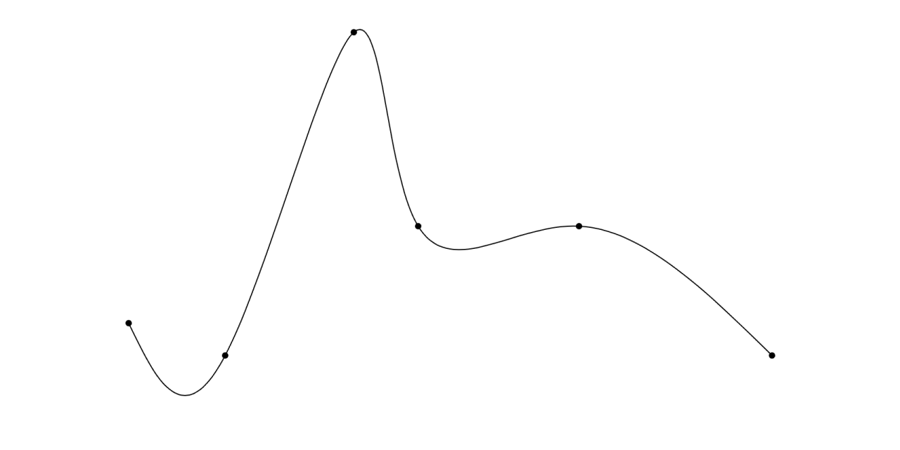

# CubicSpline

A performant cubic spline.

## Usage

``` swift
    import CubicSpline
    import CubicSplineUI

    let points:[SIMD2<Double>] = [[0.0,0.9],[0.3,1.0],[0.7,0.0],[0.9,0.6],[1.4,0.6],[2,1.0]]
    
    let spline = CubicSpline(points:points)

``` 

Create a SwiftUI view like this:

```swift
SplineView(spline:spline)
```


This view will stretch the spline to fit the available space. If that is not do exactly what you want, you can obtain a path from the spline :

``` swift
let path = spline.path
```
This path will be at the same coordinate system as the points used to create the spline. You can then transform the path as needed and construct your own shape.

The spline is callable, with a value in the range 0...1 :

```swift
    let u = spline(t: 0.1)
```

You can get an array of cubic curves, which are also callable in the range 0...1:

```swift
    let curve = spline.cubicCurves.first!
    let v = curve(t: 0.5)
```


## Performance

$O(n)$

CubicSpline uses the Accelerate framework (or LAPack on Linux) to speed up the linear algebra. Building a spline with 10 000 points takes  0.02 s on a M1 Max Mac Pro. 

## Linux
I have not tested on Linux yet, but it *should* work. You will need install LAPack:

`sudo apt-get install liblapacke-dev`

Note that CubicSplineUI is not available on Linux, as it requires SwiftUI. 

## References

https://mathworld.wolfram.com/CubicSpline.html
